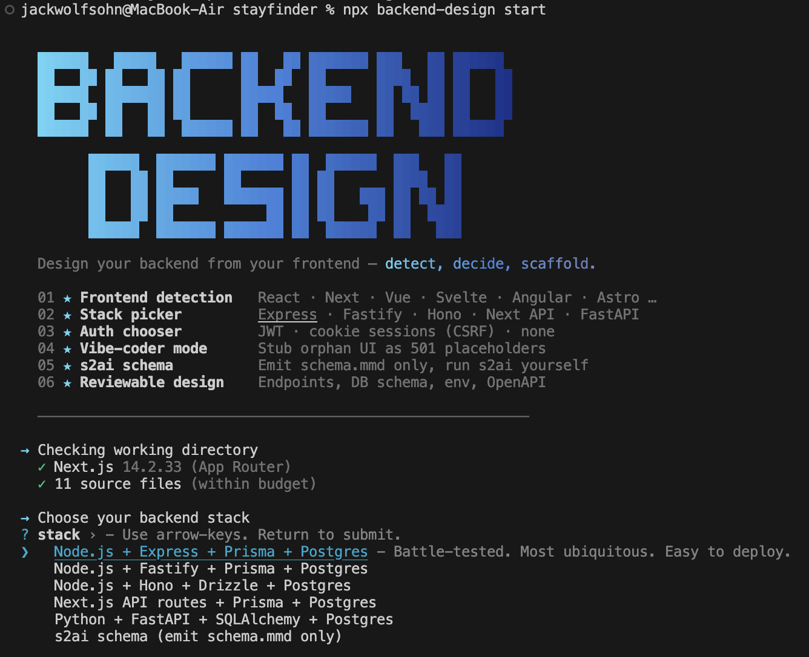

<p align="center">
  
</p>

<p align="center">
  <strong>Design your backend from your frontend.</strong><br>
  A <a href="https://claude.com/claude-code">Claude Code</a> skill that reads any modern web frontend and scaffolds a matching backend in the stack of your choice.
</p>

<p align="center">
  <a href="https://www.npmjs.com/package/backend-design"></a>
  <a href="https://www.npmjs.com/package/backend-design"></a>
  <a href="#"></a>
  <a href="LICENSE"></a>
</p>

## Quick start

```bash
cd my-frontend-project
npx backend-design start
```

Then open Claude Code in the same directory and run:

```
/backend-design
```

That's it. The skill auto-registers project-local at `./.claude/skills/backend-design` on first run, picks up your stack and auth choices from `start`, and walks through inventory, design review, and code generation. Want it across every project? Run `backend-design install` for a global install at `~/.claude/skills/`.

<p align="center">
  
</p>

Release notes: [CHANGELOG.md](CHANGELOG.md).

## What you get

A single `backend-design.md` you review before any code is written. Excerpt:

```markdown
## Entity map
- **Post** (`posts`) — one-to-many → Comment via `post_id` (on delete: cascade)
- **Comment** (`comments`) — belongs-to → User via `author_id`
- **User** (`users`)

## API endpoints
| Method | Path                | Auth | Body            | Triggered by        |
|--------|---------------------|------|-----------------|---------------------|
| `GET`  | `/api/posts`        | none | —               | src/Feed.tsx:18     |
| `POST` | `/api/posts`        | jwt  | `title, body`   | src/NewPost.tsx:42  |
| `POST` | `/api/auth/login`   | none | `email, pw`     | _inferred_ from `auth_required_screen` |
```

Plus `backend-design-next-steps.md` (blockers + wire-up TODOs), `backend-design.env.example`, and `openapi.json` at repo root.

## Supported frontends

Auto-detected via `package.json` and a couple of key files:

- **Next.js** (App Router or Pages Router)
- **React** (Vite, CRA, generic SPA)
- **Vue** (SPA)
- **Nuxt** 3
- **Svelte** / **SvelteKit**
- **Angular** 17+
- **Astro**
- **SolidJS** / **SolidStart**
- **Qwik** / Qwik City
- **Remix** / React Router v7
- **Gatsby**
- **HTMX**
- **Vanilla** HTML + JS

## Supported stacks

You pick one when you run `npx backend-design start`:

| Stack | When to use |
|-------|-------------|
| **Node.js + Express + Prisma + Postgres** | Battle-tested default. Most ubiquitous. Easy to deploy. |
| **Node.js + Fastify + Prisma + Postgres** | ~2× faster than Express. Schema validation built in. |
| **Node.js + Hono + Drizzle + Postgres** | TypeScript-first, edge-ready. Drizzle is leaner than Prisma. |
| **Next.js API routes + Prisma + Postgres** | Colocated with the frontend. Easiest Vercel deploy. |
| **Python + FastAPI + SQLAlchemy + Postgres** | Strong typing, async by default. SQLAlchemy 2 + alembic. |
| **s2ai schema only** | Emit a Mermaid `schema.mmd` for s2ai. No server scaffolded. |

Auth options: **JWT** (stateless, SPA/mobile), **cookie session** (browser-only apps that need real logout, CSRF included), or **none** (no users).

## What it does

1. **Inventory.** Four parallel Sonnet subagents walk the frontend and record every screen, component, network call, form, button, and auth surface as structured JSON.
2. **Synthesis.** One Sonnet subagent infers entities, relationships, endpoints, and an auth model. Every entity gets `deleted_at` (soft delete), `version` (optimistic lock), and `created_by`/`updated_by` (audit). Auth is auto-scaffolded when implied (auth-gated screens, token-shaped storage keys, bearer headers, `/api/auth/*` fetches), not only when a login form exists. When user-owned mutations exist but no auth surface does, you get a placeholder `users` entity with nullable FKs and an Open Question, not a silently-fabricated auth flow. Domain patterns (e-commerce, chat, social, booking, CMS) become Open Questions with recommended entities, never silent additions.
3. **Validate.** Checks invariants: every FK resolves, every endpoint has a UI trigger, every entity has a PK, signal-7 contracts hold, and more.
4. **Gaps.** Detects missing env vars (`DATABASE_URL`, `JWT_SECRET`, OAuth/Stripe secrets, webhook secrets, email provider keys, `UPLOADS_DIR`), missing auth UI, and unwired buttons. Writes a separate `backend-design-next-steps.md` with fix instructions plus a copy-pasteable `backend-design.env.example` at repo root.
5. **Skeptic pass.** One adversarial Sonnet agent re-reads the design across security, scalability, multi-tenancy, and operability axes. Surfaces IDOR-shaped path params, list endpoints with no matching index, unbounded webhook handlers, missing health endpoints, PII exposure. Capped at 8 findings.
6. **Review.** You see a single deterministic `backend-design.md` (rendered from the state JSON) and decide. No code is written until you approve.
7. **Scaffold.** Generates the backend in your chosen stack with vitest/pytest tests against a real ephemeral Postgres (testcontainers), a security baseline (helmet/secure-headers, tighter rate limits on writes, CORS allowlist that refuses `*` in production, structured request logging), and an **OpenAPI 3.1 contract** plus a Swagger UI at `/docs`. Session strategy adds CSRF per stack.

On re-runs, a Phase 0 check compares the current frontend signature (git HEAD + dirty hash, or content hash) to the prior run and resumes at the right step. Frontend unchanged + design approved + scaffold done? It just refreshes the gap report and stops.

## Design choices

- **Postgres only.** Strong FKs, mature JSON support, the widest hosting story. Adding MySQL or SQLite means a parallel codegen prompt per stack. PRs welcome.
- **No NoSQL.** The skill infers entities and relationships from the UI, which assumes a relational target. Mongo or DynamoDB would need an entirely different inference model (denormalize for access patterns) and is out of scope.
- **JSON state in `.backend-design/state/`, one file per category.** Diffable in code review, scriptable, parallel-safe. `render-design.mjs` is the only thing that produces the human-readable Markdown.
- **Five stacks, not fifty.** Covers the most common new-backend choices in 2026. Rails, Django, Go, Rust are all good. Each is roughly a 500-line codegen prompt away. PRs welcome.
- **Frontend = source of truth.** Auth-from-signals, soft-delete, audit columns, and optimistic-lock are auto-scaffolded as infrastructure. Product features (admin panels, notifications, analytics) are never invented. They go through Open Questions for explicit approval.
- **One review gate, not many.** The skill produces a single reviewable design doc instead of asking 20 questions during inference. The skeptic pass adds adversarial findings but doesn't pause.
- **Sonnet everywhere, not Haiku.** I tried Haiku for Phase 1 inventory. It dropped template-literal URL resolution and missed existing handlers. Sonnet is reliable. Cost is a few dollars per run.

## What it doesn't do (yet)

- **Async jobs / queues.** Not inferable from the UI. Pick a queue that fits your runtime (BullMQ + Redis for Node, pg-boss for Postgres-native, Inngest or Trigger.dev for serverless, Celery for Python) and wire it manually.
- **WebSockets.** Server scaffolding is easy; channels, presence, auth-on-connect, and pub/sub at scale are template-resistant. Reach for [Pusher](https://pusher.com), [Ably](https://ably.com), or Supabase Realtime if you don't want to build it.
- **Multi-database.** Postgres only, by choice. Prisma, Drizzle, and SQLAlchemy all support MySQL and SQLite. PRs that add per-DB type mappings and migration syntax to each codegen prompt are welcome.
- **GraphQL.** Intentionally out of scope. The skill assumes REST/JSON inference from `fetch()` calls. A GraphQL pipeline would need a different inference model entirely. If you want GraphQL on top, hand-write a thin layer over the generated REST handlers.

## Vibe-coder mode (opt-in)

`npx backend-design start` asks whether to scaffold placeholder endpoints for orphan UI signals (e.g. a "Become a host" button with no handler). When **on**, Phase 2 emits stub endpoints with `temporary: true` and codegen wraps them in 501 handlers that throw loudly in dev. Paths are best-guesses; the next-steps doc flags each for review. Default is **off** (strict mode: orphan buttons become wire-up TODOs, no endpoints invented).

## Commands

| Command | What it does |
|---------|--------------|
| `npx backend-design start` | Pick stack + auth + vibe-coder mode. Auto-registers the skill on first run. |
| `npx backend-design validate` | Check `.backend-design/state/*.json` against invariants |
| `npx backend-design gaps` | Re-detect gaps and refresh next-steps.md, env.example, and openapi.json |
| `npx backend-design status` | Show phase progress, frontend signature, and open gap counts |
| `npx backend-design reset` | Delete `.backend-design/` and generated docs (asks for confirmation) |
| `npx backend-design install` | Symlink the skill globally into `~/.claude/skills/`. Only needed for cross-project use. |
| `npx backend-design uninstall` | Remove the global and/or project-local symlink |
| `npx backend-design help` | Show usage |

## Generated artifacts

At repo root after a run:

- **`backend-design.md`** — the design doc, 8 sections, regenerated from state JSON each run
- **`backend-design-next-steps.md`** — your action checklist (blockers, wire-up TODOs, info items)
- **`backend-design.env.example`** — copy-pasteable `.env` template, every var commented
- **`openapi.json`** — OpenAPI 3.1 contract. Codegen copies it into the scaffold so Swagger UI at `/docs` serves the same spec.

Internal state lives under `.backend-design/state/` (one file per category: `screens.json`, `components.json`, `endpoints.json`, `forms.json`, `entities.json`, `relationships.json`, `auth.json`, `open_questions.json`). Every JSON entry includes `evidence: ["file:line"]` so you can trace any decision back to the UI.

## Cost

Rough token budget on a medium Next.js app (~200 source files). Real cost varies with repo complexity and current Anthropic pricing; treat these as ballparks.

| Phase | Tokens (approx) |
|-------|-----------------|
| Phase 1 — 4 parallel inventory agents | ~80K |
| Phase 2 — synthesis + validation | ~25K |
| Phase 2.6 — skeptic pass | ~15K |
| Phase 4 — codegen + tests + security | ~55K |
| **Total** | **~175K** |

Expect a few dollars per end-to-end run on a typical app, more on large or convoluted ones. The `start` command warns at >500 source files and refuses at >1500 (asks you to scope down).

## Durable install (optional)

`npx backend-design start` auto-registers the skill on first run, which is enough for most users. The symlink it creates points at npx's cache, though, so it can break when the cache is pruned.

For a permanent install:

```bash
npm i -g backend-design
backend-design install
```

Or from a clone (most stable for development):

```bash
git clone https://github.com/jwolfsohn/backend-design && cd backend-design
node bin/backend-design.mjs install
```

Either way you get `~/.claude/skills/backend-design` pointing at the package. Skills load at session startup, not live, so if you have Claude Code open, exit (`/exit`) and re-run `claude`. Uninstall with `backend-design uninstall`.

## Platform support

macOS and Linux. The installer uses symlinks and shells out to `find` and `wc` for the file count check; Windows users should run inside WSL2.

## License

MIT
